# Actividad: Introducción a Git - conceptos básicos y operaciones esenciales

## Conceptos básicos de Git: Comienza con una experiencia práctica

### git config: Preséntate a Git  

Definimos nuestro nombre y email a nivel **systema** usando la bandera `--global`:  

```shell
$ git config --global user.name "Lerzundi"
$ git config --global user.email "juan.lerzundi.r@uni.pe"
```

Y confirmamos el cambio usando la bandera `--list`:  

```shell
$ git config --list
```  
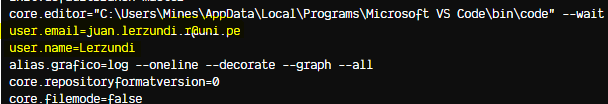  

<hr></hr>

### git init: Donde comienza tu viaje de código  

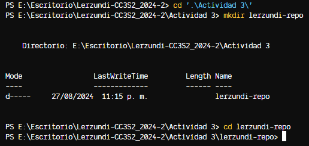

Luego de crear un directorio y acceder a él, usamos `git init` para inicializar un repositorio  

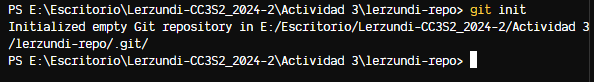  
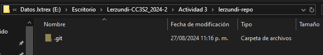  

Vemos que ahora tenemos una carpeta oculta `.git` donde se guardarán los cambios en el archivo.

<hr></hr>

### git add: Preparando tu código  

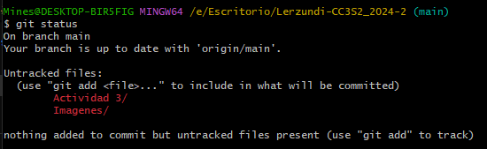  
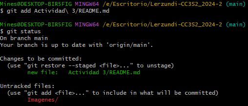  

Creamos un archivo `README.md` que luego rastreamos con el comando `git add README.md`, situándonos en el estado de preparación o index.  

<hr></hr>

### git commit: registra cambios  

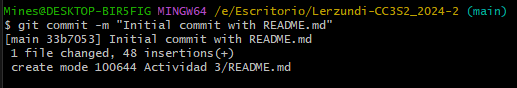  
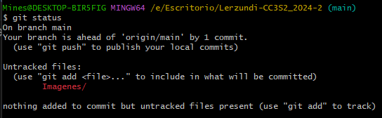  

Guardamos nuestros cambios usando el `commit`:  

```shell
$ git commit -m "Initial commit with README.md
```  

Y ya no vemos al archivo `README.md` como no seguido.  

<hr></hr>

### git log: Recorrer el árbol de commits  

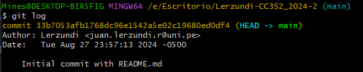  


**¿Cuál es la salida de este comando?**

```shell
$ git log --graph --pretty=format:'%x09 %h %ar ("%an") %s'
```

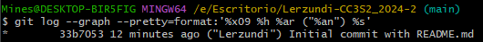  

Usemos el comando `git log` para una siguiente actividad, creamos el archivo `CONTRIBUTING.md` y editamos el archivo `README.md` con el texto `"README\n\nWelcome to the project"`.
Luego los añadimos a `git` y hacemos un commit.

Finalmente, agregamos el archivo `main.py` y lo llenamos con un código de ejemplo:  

```shell
$ echo "print('Hello World')" > main.py
```

Y hacemos un commit luego de registrar los cambios.

```shell
git log --oneline
```  
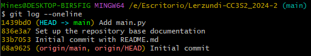  

## Trabajar con branches: La piedra angular de la colaboración

### git branch: Entendiendo los conceptos básicos de Git branch

  
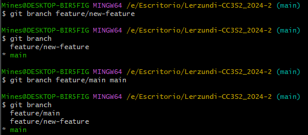  

**Crear una branch desde una branch específica**  

```shell
$ git branch <new-branch-name> <base-branch-name>
```  

**Crear una branch desde un commit específico**  

```shell
$ git branch <new-branch-name> <commit-hash>
```  

### git checkout/git switch: Cambiar entre branches 

**Cambiar a la branch feature/new-feature:**   

```shell
$ git checkout feature/new-feature
```

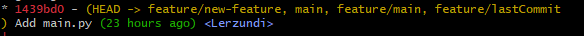  

**Ejemplos adicionales:**  

**Crear una branch desde una branch específica**

```java
// Verifica en qué rama estás actualmente
$ git branch
// Cambia a la rama 'develop' si no estás en ella
$ git checkout develop
// Crea una nueva rama 'feature/login' desde 'develop'
$ git branch feature/login develop
// Cambia a la nueva rama 'feature/login'
$ git checkout feature/login
Crear una branch desde un commit específico
// Verifica el historial de commits para identificar el commit específico
$ git log --oneline
// Crear una nueva rama 'hotfix/bugfix' basada en el commit 'abc1234'
$ git branch hotfix/bugfix abc1234
// Cambia a la nueva rama 'hotfix/bugfix'
$ git checkout hotfix/bugfix
```

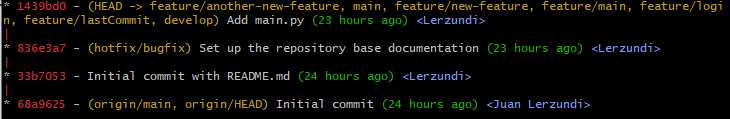  

### git merge \<Branch Name>: Fusionando branches

Primero, cambia a la branch en la que deseas fusionar

```shell
$ git checkout main
```
Ahora, fusiona tu branch de características

```shell
$ git merge feature/new-feature
```

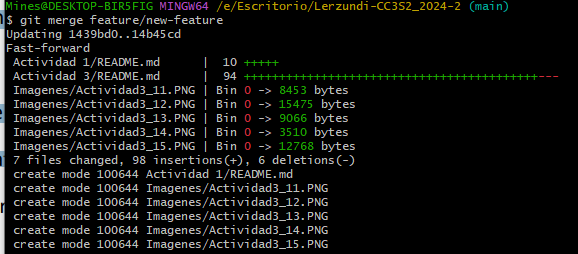  

### git branch -d: Eliminando una Branch

```shell
$ git branch -d feature/new-feature
```

### Preguntas:  

- ¿Cómo te ha ayudado Git a mantener un historial claro y organizado de tus cambios?
  -  Haciendo un seguimiento de cada archivo mediante el comando mediante `git commit` y asignándole un indentificador único.
- ¿Qué beneficios ves en el uso de branches para desarrollar nuevas características o corregir errores?
  - Se hace evidente la utilidad de poder trabajar en un entorno aislado partiendo de la última revisión del software, nos permite simular decisiones en nuestro sistema y decidir si queremos mantener estas o no.
- Realiza una revisión final del historial de commits para asegurarte de que todos los cambios se han registrado correctamente.
  - 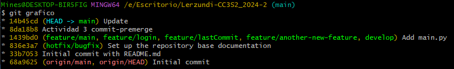  
- Revisa el uso de branches y merges para ver cómo Git maneja múltiples líneas de desarrollo
  - [git Branch](#git-branch-entendiendo-los-conceptos-básicos-de-git-branch), [git Merge](#git-merge-branch-name-fusionando-branches)

## Ejercicios

### Ejercicio 1: Manejo avanzado de branches y resolución de conflictos

Crea una nueva rama `feature/advanced-feature`

```shell
$ git branch feature/advanced-feature
$ git checkout feature/advanced-feature
```

Modifica el archivo `main.py`

```python
def greet():
 print('Hello from advanced feature')

 greet()
```

y confirma los cambios

```shell
$ git add main.py
$ git commit -m "Add greet function in advanced feature"
```

Realizamos otro cambio en la rama `main`

```shell
$ git checkout main
```

**main.py**
```
print('Hello World - updated in main')
```

```shell
$ git add main.py
$ git commit -m "Update main.py message in main branch"
```

Intentamos fusionar las ramas, pero nos topamos con un conflicto  

```shell
$ git merge feature/advanced-feature
```

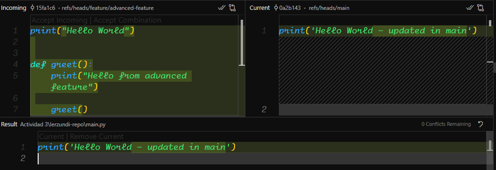  
En vscode podemos abrir el Menú de Merge para solucionar los conflictos y completar el Merge con un botón

```shell
$ git add main.py
$ git commit -m "Resolve merge conflict between main and feature/advanced-feature"
```
Finalizamos el merge y eliminamos la rama creada

```shell
$ git branch -d feature/advanced-feature
```

### Ejercicio 2: Exploración y manipulación del historial de commits

Ver el historial de commits:

```shell
$ git log -p
```

**Examina las diferencias introducidas en cada commit. ¿Qué cambios fueron realizados en cada uno?**  
Se muestran en verde las líneas agregadas a nuestros archivos 

**<ins>Filtrar las commits por autor:</ins>**  

```shell
$ git log --author="Lerzundi"
```

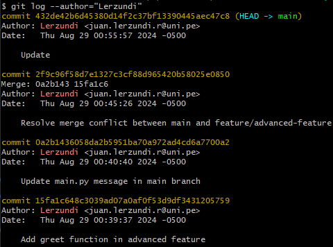  

<ins>**Revertir un commit:**</ins>

**main.py**
```python
print("Hello World")


def greet():
    print("Hello from advanced feature")

    greet()


print("Hello from advanced feature")
```
Revertimos el último commit, para borra la función repetida en main.

```shell
$ git revert HEAD
```
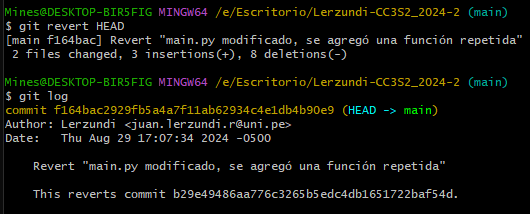  

**<ins>Rebase interactivo:</ins>**

```shell
$ git rebase -i HEAD~3
```  
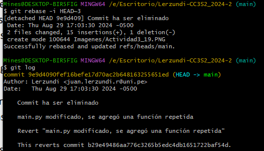  

**<ins>Visualización gráfica del historial</ins>**

```shell
$ git log --graph --oneline --all
```  
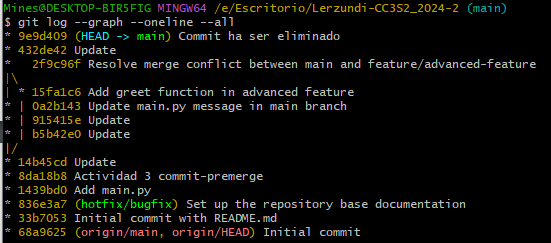  

**Reflexiona sobre cómo el historial de tu proyecto se visualiza en este formato. ¿Qué información adicional puedes inferir?**  
Del gráfico podemos obtener el commit exacto en la que una nueva funcionalidad fue implementada o cuándo un bug fue solucionado. Adicionalmente, las versiones del software representadas en las ramas activas del programa como podría ser una rama de producción y otra de testeo. Con la cantidad de ramas fusionadas también podemos determinar la cantidad de revisiones que tuvo el software.

## Ejercicio 3: Creación y gestión de branches desde commits específicos

**<ins>Crea una nueva rama desde un commit específico:</ins>**  

```shell
$ git branch bugfix/rollback-feature <commit-hash>
$ git checkout bugfix/rollback-feature
```
**<ins>Modificar y confirmar cambios en la nueva rama:</ins>**

**main.py**

```python
print('Hello World - updated in main')

def greet():
    print('Fixed in feature')
```

Añade y confirma los cambios en la nueva rama:
```shell
$ git add main.py
$ git commit -m "Fix bug in rollback feature"
```

**<ins>Fusionar los cambios en la rama principal:</ins>**

```shell
$ git checkout main
$ git merge bugfix/rollback-feature
```

**<ins>Explorar el historial después de la fusión:</ins>**

```shell
$ git log --graph --oneline
```
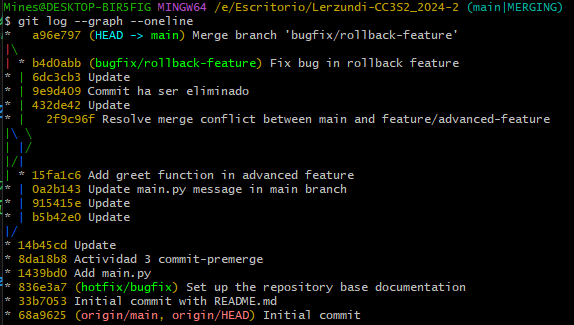  
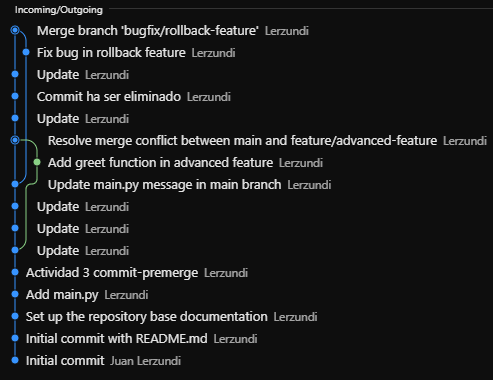  

**<ins>Eliminar la rama bugfix/rollback-feature:</ins>**

```shell
$ git branch -d bugfix/rollback-feature
```
## Ejercicio 4:
